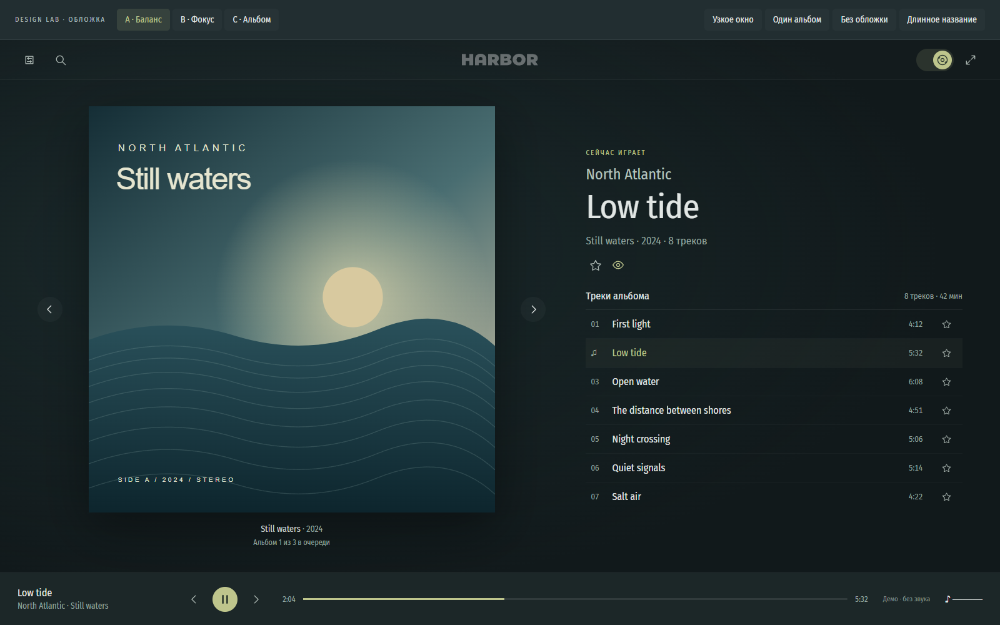
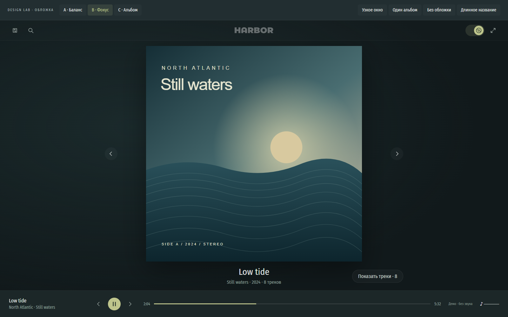
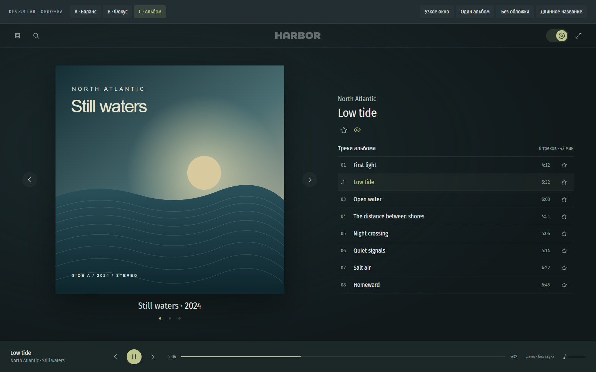

# Режим обложки: варианты компоновки и план

[Интерактивный мокап](cover-mode.html) открывается напрямую в браузере, без
сборки, сервера и API. Три варианта переключаются кнопками A/B/C и ссылками
`#split`, `#focus`, `#album`. Выбранный C реализован в приложении с уточнениями
ниже; статичные мокапы сохранены как история выбора компоновки.

Все данные вымышлены. Иллюстрация создана для мокапа и повторяется у трёх
демонстрационных альбомов. Шрифты и логотип локальные, внешних запросов нет.
DESIGN LAB и его переключатели — инструменты сравнения, не часть продукта.
Нижний плеер условный: звук, время и громкость не моделируются.

## Выбранное направление: C · Альбом

- Без подписи «Сейчас играет».
- Вместо «Альбом 1 из 3 в очереди» — по точке на каждый альбомный блок
  плейлиста; точка просматриваемого альбома ярче.
- Точки позволяют перейти к альбому, не меняя воспроизведение. Стрелки остаются.
- При одном альбоме точки и стрелки скрыты, геометрия обложки сохраняется.
- Название и год альбома находятся над обложкой, точки — под ней.
- Название звучащего трека и исполнитель — отдельный блок справа.
  При просмотре другого альбомного блока он скрывается, первый трек
  просматриваемого альбома вместо звучащего не подставляется.
- Треклист без общей тёмной подложки; разделители и подсветка текущей строки
  сохраняются.
- Максимально переиспользовать существующие контролы, иконки, типографику
  и цвета приложения. Мокап показывает компоновку, не новую дизайн-систему.

Мокап открывается на C по умолчанию. A/B оставлены только для сравнения.

## Варианты

### A · Баланс

- Крупная обложка слева, текущий трек и треклист справа.
- Обложка в мокапе **650 × 650** при окне 1600 × 1000, вместо примерно
  324 × 324 в текущей двухколоночной компоновке.
- Заголовок трека не конкурирует с обложкой; исполнитель и альбом вторичны.
- Стрелки рядом с обложкой, подпись сообщает положение альбома в очереди.
- Рейтинг альбома и отметка прослушивания отделены от действий над треками.
- Треклист остаётся доступен без дополнительного раскрытия.

Лучший баланс увеличенной обложки и повседневного выбора треков.
Можно реализовать без нового режима, настройки или панели.

### B · Фокус

- Обложка по центру, **680 × 680** в том же окне.
- Название трека и альбом компактно расположены под обложкой.
- Треклист скрыт по умолчанию; кнопка «Показать треки» раскрывает правую колонку.
- Подходит для спокойного прослушивания, но выбор трека требует лишнего действия.
- Оценки альбома доступны в раскрытом представлении.

Возможное дальнейшее развитие A, но не предлагается внедрять оба варианта
одновременно: это добавит состояние и удвоит матрицу проверок.

### C · Альбом

- Обложка и название альбома образуют левый блок, **614 × 614** в том же окне.
- Справа компактная информация о текущем треке и более высокий треклист.
- Восемь строк видны одновременно; меньше акцента на заголовке текущего трека.
- Удобнее для последовательного прослушивания альбомов и навигации по очереди.
- Под названием альбома — точки плейлиста, без текстового счётчика.
- Над информацией о треке нет подписи «Сейчас играет».

Выбранный вариант: приоритет — альбом как целое, а не текущая композиция.

## Что можно попробовать

- Поиск: только иконка → поле с фокусом; ввод → демонстрационный результат;
  очистка сохраняет фокус; Escape очищает и сворачивает; пустое поле
  сворачивается при уходе фокуса.
- Выбор результата и строки трека меняет демонстрационный плеер.
- Стрелки альбомов меняют просмотр, но не текущую композицию в плеере.
- В C точки переключают просматриваемый альбом и показывают его положение.
- «Один альбом» скрывает стрелки без уменьшения обложки.
- «Без обложки» показывает заглушку с той же геометрией.
- «Длинное название» проверяет перенос большого заголовка.
- «Узкое окно» моделирует область шириной 390px; можно также менять окно браузера.
- В B можно показать и скрыть треклист. Клик на изображение открывает просмотр.
- Пауза, избранное и отметка прослушивания — локальные демо-переключатели,
  ничего не сохраняют. Настройки и переход в каталог намеренно отключены.

## План реализации выбранного C

### 1. Одинаковый поиск в каталоге и режиме обложки

Сейчас каталог уже использует сворачиваемый поиск
(`src/client/CatalogUserFilters.tsx`, блок `.catalog-search`), а режим обложки
создаёт отдельный постоянно раскрытый `<label className="search">` в
`src/client/App.tsx`.

- Выделить существующее представление сворачиваемого поиска в общий компонент,
  не переносить в него фильтры, запросы или результаты.
- Использовать его в обоих режимах с независимыми значениями `search` и
  `coverSearch`; существующий QuickSearchDialog оставить источником результатов.
- Сохранить правило каталога: раскрыт, если есть фокус или непустой запрос.
- Перенести существующую защиту от сворачивания при pointer-взаимодействии,
  чтобы очистка и соседние действия не теряли клик.
- Уточнить Escape для режима обложки: сначала закрывает поиск/результаты,
  затем отдельный Escape выходит из режима. Возвращать фокус на кнопку.
- Проверить положение результатов относительно раскрытого поля и отсутствие
  пересечения с логотипом в узком окне.

### 2. Переверстать основной блок по C

Затронуты `src/client/CoverMode.tsx` и блок режима обложки в
`src/client/styles/base.css`.

- Слева — название/год альбома, крупная обложка со стрелками и точки под ней.
  Справа — компактная информация о треке, действия альбома и высокий треклист.
  Плеер остаётся внизу приложения. Подпись «Сейчас играет» не добавлять.
- Убрать узкий общий лимит 1100px и предел 440px для всей колонки обложки:
  сейчас внутри этих 440px ещё помещаются стрелки и зазоры.
- Отдать обложке большую долю ширины; справа оставить минимум для читаемого
  треклиста. Ориентир — 600–650px при 1600 × 1000 и около 420px при 1366 × 768.
- Размер считать по доступному контейнеру между верхней панелью и плеером,
  а не отдельными приблизительными вычитаниями из `100dvh`.
  Фиксированные вычитания в мокапе — только способ показать пропорции.
- Обложка квадратная, изображение без обрезки (`object-fit: contain`).
  Для неквадратных исходников остаются поля; исходный просмотр сохраняется.
- Сохранить явные позиции обложки и стрелок в сетке из предыдущего фикса.
- Просмотр другого альбома не запускает воспроизведение. Яркая точка следует
  за просматриваемым альбомом; текущий звучащий трек по-прежнему отмечается
  в треклисте и нижнем плеере.
- Расширить ответ существующего album-block API списком `blocks`:
  начальная позиция трека, ключ и название альбома. `position` — позиция
  трека в очереди, не индекс альбома; одного `totalBlocks` недостаточно.
  Переходить через существующий `setViewedBlock`. Считать позиции плейлиста,
  не уникальные альбомы: повторный альбом в другой позиции не объединять.
  При длинном плейлисте сохранить все точки в прокручиваемой полоске
  и держать активную в видимой области. Отрисовывать только видимые точки
  через существующий TanStack Virtual; прокручивать только горизонтальную
  полоску, не всю страницу. Один Tab-вход, переходы Left/Right/Home/End.
- Убрать `background` у `.cover-tracklist`, сохранить существующие разделители,
  подсветку текущей строки и состояния загрузки/ошибки.
- Оставить `Player`, `IconToggle`, `RatingControl`, `ViewedToggle`,
  `playing-bars`, просмотр оригинала обложки и текущую
  логику подгрузки/прокрутки треков. Использовать существующие классы кнопок,
  Lucide-иконки, CSS-переменные цветов и типографики.
  Новый стиль нужен только для геометрии блоков и точек, которых сейчас нет.
  Рисованные кнопки статического мокапа не переносить в приложение.

### 3. Адаптивность и крайние состояния

- При недостаточной ширине: обложка сверху, информация и треклист ниже;
  вертикальная прокрутка основной области допустима, горизонтальная — нет.
- Один источник геометрии для узкого окна и принудительного портретного режима.
  Не поддерживать два расходящихся набора одинаковых CSS-правил.
- Длинное название переносится, не отнимая ширину у обложки.
- Большой треклист прокручивается внутри своей области; текущий трек виден.
- Проверить отсутствие обложки, неквадратное изображение, один/несколько
  альбомов, загрузку блока очереди, отсутствие результатов поиска и fullscreen.
- Фоны, пользовательские цвета, размер шрифта и фон приложения сохраняются;
  нейтральный фон мокапа не означает замену оформления продукта.

### 4. Проверки и критерии приёмки

- Playwright в Chrome и Edge: раскрытие/сворачивание поиска, клавиатурный
  фокус, очистка, Escape, выбор результата и независимость поиска каталога.
- Геометрия обложки в окнах 1600 × 1000, 1366 × 768, 800 × 1000 и 390 × 844,
  принудительном портретном и полноэкранном режимах.
- При исчезновении стрелок размер обложки не меняется; заглушка имеет ту же
  площадь; большая обложка не закрывает плеер и элементы управления.
- Проверить соответствие количества точек блокам плейлиста, смену яркой точки
  при навигации стрелками/точками/смене трека, отсутствие запуска музыки
  от выбора точки и доступность точек с клавиатуры.
- Для базового сценария C при 1600 × 1000 обложка не меньше 600px.
  Треклист доступен без раскрытия; основной блок помещается по высоте.
- Прогнать `npm run lint`, `npm run typecheck`, `npm run build`,
  целевые тесты поиска/режима обложки и desktop smoke, затем сравнить скриншоты.

API очереди расширяется только метаданными альбомных блоков.
Хранение настроек, обработка аудио и изменение очереди не входят в фикс.
Новая настройка «вариант компоновки» и самостоятельный режим B — вне первой версии.
